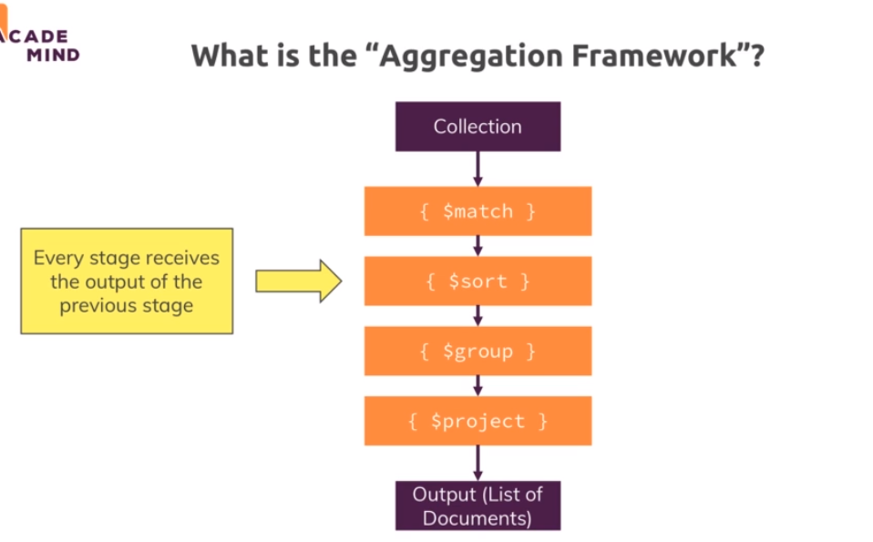
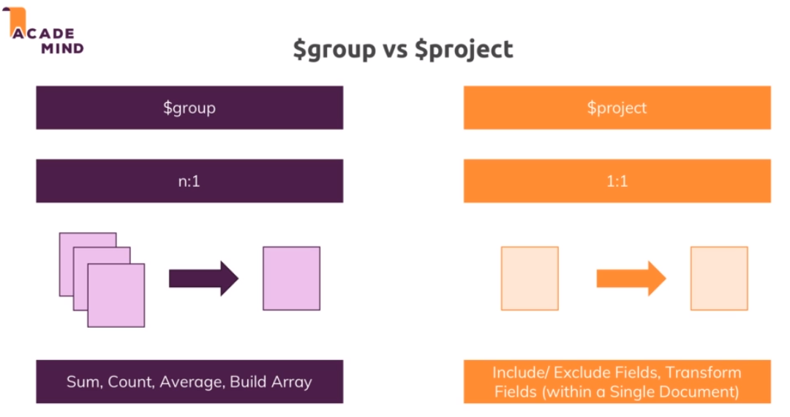

# 10-Aggregation-Framework
1. [Intro](#schema1)
2. [Using the Aggregation Framework](#schema2)
3. [Working with $project](#schema3)
4. [Turning the Location Intro a geoJson Object](#schema4)
5. [$group vs $project](#schema5)
6. [Pushing Elements Into Newly Created Arrays](#schema6)
7. [`$unwind` & Eliminating Duplicate Values](#schema7)
8. [Using Projection with Arrays & Length of an Array](#schema8)
9. [Using the `$filter` Operator](#schema9)


<hr>

<a name="schema1"></a>

## 1. Intro


El Aggregation Framework es una característica poderosa de MongoDB que permite realizar operaciones de procesamiento 
y transformación de datos en documentos almacenados en una colección. En lugar de realizar consultas simples para 
recuperar documentos, el Aggregation Framework permite realizar operaciones más complejas y realizar análisis avanzados 
en los datos.

El Aggregation Framework utiliza un enfoque de canalización, donde los documentos pasan a través de varias etapas de o
peraciones de agregación que se aplican secuencialmente. Cada etapa realiza una operación específica en los documentos 
de entrada y pasa los resultados a la siguiente etapa.

Las operaciones de agregación en el Aggregation Framework incluyen una variedad de funciones y expresiones,
como `$match`para filtrar documentos, $group para realizar agregaciones basadas en valores específicos, 
`$project` para seleccionar campos y transformar la estructura del documento, entre otras.

Aquí hay un ejemplo simple de cómo se vería una operación de agregación en MongoDB utilizando el Aggregation Framework:

```
db.miColeccion.aggregate([
   { $match: { estado: "activo" } },
   { $group: { _id: "$categoria", total: { $sum: "$cantidad" } } },
   { $sort: { total: -1 } }
])

```
En este ejemplo:

1. La primera etapa ($match) filtra los documentos donde el campo "estado" es igual a "activo".
2. La segunda etapa ($group) agrupa los documentos por el campo "categoria" y calcula la suma de 
la cantidad para cada categoría.
3. La tercera etapa ($sort) ordena los resultados en función del total en orden descendente.


https://docs.mongodb.com/manual/core/aggregation-pipeline/

<hr>

<a name="schema2"></a>

## 2. Using the Aggregation Framework



- Importamos los datos.

```
mongoimport persons.json -d analytics -c persons --jsonArray
```

- Primera query con un simple filtro, lista de la colección `persons` todos los elementos que el género sea femenino.

```
db.persons([{$mathc:{gender:'female'}}])
```

- Otro ejemplo
```
db.persons.aggregate([
    { $match: { gender: 'female' } },
    { $group: { _id: { state: "$location.state" }, totalPersons: { $sum: 1 } } }
]).pretty();
```

1. `$match: { gender: 'female' }`

Filtra los documentos en la colección donde el campo "gender" es igual a "female". Esto significa que solo se 
considerarán las personas de género femenino en las etapas posteriores.

2. `$group: { _id: { state: "$location.state" }, totalPersons: { $sum: 1 } }`

Agrupa los documentos restantes por el campo "location.state" y calcula el total de personas para cada estado.
El resultado de la agrupación tendrá un campo "_id" que contiene el estado y otro campo "totalPersons" 
que contiene la cantidad total de personas en ese estado.

```
{ _id: { state: 'nordland' }, totalPersons: 3 },
  { _id: { state: 'hedmark' }, totalPersons: 3 },
  { _id: { state: 'manawatu-wanganui' }, totalPersons: 8 },
  { _id: { state: 'appenzell innerrhoden' }, totalPersons: 3 },
  { _id: { state: 'eskişehir' }, totalPersons: 3 },
  { _id: { state: 'pas-de-calais' }, totalPersons: 1 },
  { _id: { state: 'siirt' }, totalPersons: 3 },
  { _id: { state: 'tyne and wear' }, totalPersons: 2 },
  { _id: { state: 'مرکزی' }, totalPersons: 8 },
  { _id: { state: 'fife' }, totalPersons: 2 },
  { _id: { state: 'rhode island' }, totalPersons: 2 },
  { _id: { state: 'new brunswick' }, totalPersons: 9 },
  { _id: { state: 'zug' }, totalPersons: 6 },
  { _id: { state: 'genève' }, totalPersons: 5 },
  { _id: { state: 'south australia' }, totalPersons: 22 },
  { _id: { state: 'nottinghamshire' }, totalPersons: 3 },
  { _id: { state: 'tocantins' }, totalPersons: 4 },
  { _id: { state: 'québec' }, totalPersons: 8 },
  { _id: { state: 'northern territory' }, totalPersons: 15 },
  { _id: { state: 'western australia' }, totalPersons: 13 }

```

- Ordenado
- 
```
db.persons.aggregate([
    { $match: { gender: 'female' } },
    { $group: { _id: { state: "$location.state" }, totalPersons: { $sum: 1 } } },
    { $sort: { totalPersons: -1 } }
]).pretty();
```

```
 { _id: { state: 'midtjylland' }, totalPersons: 33 },
  { _id: { state: 'nordjylland' }, totalPersons: 27 },
  { _id: { state: 'new south wales' }, totalPersons: 24 },
  { _id: { state: 'australian capital territory' }, totalPersons: 24 },
  { _id: { state: 'syddanmark' }, totalPersons: 24 },
  { _id: { state: 'south australia' }, totalPersons: 22 },
  { _id: { state: 'hovedstaden' }, totalPersons: 21 },
  { _id: { state: 'danmark' }, totalPersons: 21 },
  { _id: { state: 'queensland' }, totalPersons: 20 },

```


<hr>

<a name="schema3"></a>

## 3. Working with $project

Ref: https://www.mongodb.com/docs/manual/reference/operator/aggregation/project/


La etapa `$project` en el Aggregation Framework de MongoDB se utiliza para dar forma a los documentos de 
salida de la operación de agregación. Esta etapa permite especificar los campos que deseas incluir o excluir en 
los documentos de salida, así como realizar transformaciones en los valores de esos campos.


La estructura básica de la etapa $project es la siguiente:

```
{ $project: { <campo>: <expresión>, ... } }
```

``` 
db.persons.aggregate([{$project:{_id:0, gender:1, fullName:{$concat:["$name.first" ," ","$name.last"]}}}])
[
  { gender: 'male', fullName: 'carl jacobs' },
  { gender: 'male', fullName: 'victor pedersen' },
  { gender: 'male', fullName: 'harvey chambers' },
  { gender: 'male', fullName: 'zachary lo' },
  { gender: 'male', fullName: 'gideon van drongelen' },
  { gender: 'female', fullName: 'پریا پارسا' },

```
- Capitalize el nombre y el apellido
```
db.persons.aggregate([
    {
      $project: {
        _id: 0,
        gender: 1,
        fullName: {
          $concat: [
            { $toUpper: { $substrCP: ['$name.first', 0, 1] } },
            {
              $substrCP: [
                '$name.first',
                1,
                { $subtract: [{ $strLenCP: '$name.first' }, 1] }
              ]
            },
            ' ',
            { $toUpper: { $substrCP: ['$name.last', 0, 1] } },
            {
              $substrCP: [
                '$name.last',
                1,
                { $subtract: [{ $strLenCP: '$name.last' }, 1] }
              ]
            }
          ]
        }
      }
    }
  ]).pretty();

  { gender: 'male', fullName: 'Carl Jacobs' },
  { gender: 'male', fullName: 'Victor Pedersen' },
  { gender: 'male', fullName: 'Harvey Chambers' },

```

<hr>

<a name="schema4"></a>

## 4. Turning the Location Intro a geoJson Object

Se puede tener múltiples etapas `$project` en una operación de agregación en secuencia, 
donde cada etapa `$project` se aplica después de la anterior.

```
db.collection.aggregate([
  { $project: { field1: 1, field2: 1 } },
  { $project: { newField: "$field1", field2: 0 } },
  { $project: { finalField: "$newField" } }
])
```

En este ejemplo:

- La primera etapa $project incluye los campos field1 y field2.
- La segunda etapa $project crea un nuevo campo newField que es igual al valor de field1 y excluye field2.
- La tercera etapa $project crea un campo finalField que es igual al valor de newField.
Cada etapa $project se aplica secuencialmente, y el resultado de cada una se convierte en la entrada para la 
siguiente. Esto te permite realizar transformaciones más complejas en los documentos de la colección durante 
la operación de agregación.


```
db.persons.aggregate([
    {$project:{
        _id:0, name:1,email:1,location:{type: 'Point', coordinates:[
        "$location.coordinates.longitude",
        "$location.coordinates.latitude"
        ]}}},
    {
      $project: {
        gender: 1,email:1, location:1,
        fullName: {
          $concat: [
            { $toUpper: { $substrCP: ['$name.first', 0, 1] } },
            {
              $substrCP: [
                '$name.first',
                1,
                { $subtract: [{ $strLenCP: '$name.first' }, 1] }
              ]
            },
            ' ',
            { $toUpper: { $substrCP: ['$name.last', 0, 1] } },
            {
              $substrCP: [
                '$name.last',
                1,
                { $subtract: [{ $strLenCP: '$name.last' }, 1] }
              ]
            }
          ]
        }
      }
    }
  ]).pretty();
```
```
  {
    location: { type: 'Point', coordinates: [ '-90.4049', '-65.0877' ] },
    email: 'delia.durand@example.com',
    fullName: 'Delia Durand'
  }

```
- $convert, convierte una entrada al tipo que le digamos.
```
db.persons.aggregate([
    {$project:{
        _id:0, name:1,email:1,location:{type: 'Point', coordinates:[
        {$convert:{ input:"$location.coordinates.longitude",to: "double",onError: 0, onNull: 0.0}},
        {$convert:{ input:"$location.coordinates.latitude",to: "double",onError: 0, onNull: 0.0}}
        ]}}},
    {
      $project: {
        gender: 1,email:1, location:1,
        fullName: {
          $concat: [
            { $toUpper: { $substrCP: ['$name.first', 0, 1] } },
            {
              $substrCP: [
                '$name.first',
                1,
                { $subtract: [{ $strLenCP: '$name.first' }, 1] }
              ]
            },
            ' ',
            { $toUpper: { $substrCP: ['$name.last', 0, 1] } },
            {
              $substrCP: [
                '$name.last',
                1,
                { $subtract: [{ $strLenCP: '$name.last' }, 1] }
              ]
            }
          ]
        }
      }
    }
  ]).pretty();
```
```
 {
    location: { type: 'Point', coordinates: [ -90.4049, -65.0877 ] },
    email: 'delia.durand@example.com',
    fullName: 'Delia Durand'
  }

```
- $isoWeekYear

Se utiliza en las expresiones de agregación dentro del Aggregation Framework. Este operador extrae el año 
ISO (Año según el sistema de semanas ISO) de una fecha dada.

```
{ $group: { _id: { birthYear: { $isoWeekYear: "$birthdate" } }, numPersons: { $sum: 1 } } },
```
```
  { _id: { birthYear: Long('1955') }, numPersons: 113 },
  { _id: { birthYear: Long('1961') }, numPersons: 111 },
```

<hr>

<a name="schema5"></a>

## 5. $group vs $project



- $project:

La etapa $project se utiliza para dar forma a los documentos de salida de la operación de agregación. Permite 
especificar qué campos deseas incluir o excluir en los documentos de salida, así como realizar transformaciones en 
los valores de esos campos.
Puedes crear nuevos campos, modificar valores de campos existentes, renombrar campos y decidir qué campos incluir o 
excluir en los resultados.

- $group:

La etapa $group se utiliza para agrupar documentos basándose en un campo específico y realizar operaciones de 
agregación en esos grupos. Se utiliza comúnmente con funciones de agregación como $sum, $avg, $min, $max, entre otras.
Puedes agrupar documentos y calcular valores agregados sobre esos grupos.

 $project se centra en dar forma y transformar documentos, mientras que $group se centra en agrupar documentos y 
 realizar operaciones de agregación en esos grupos. Pueden utilizarse en conjunto en una operación de agregación más 
 amplia para lograr resultados específicos.


<hr>

<a name="schema6"></a>

## 6. Pushing Elements Into Newly Created Arrays

- Importamos los datos array-data.json y creamos una colección nueva. Vamos a trabajar con arrays.


```
mongoimport persons.json -d analytics -c friends --jsonArray
```
`commands-9.js`

Cuando trabajas con datos que contienen arrays en la Aggregation Framework de MongoDB, hay algunas consideraciones 
y operadores específicos que puedes utilizar para manipular y procesar esos arrays. Algunas diferencias clave incluyen:

**Operadores para Arrays:**

MongoDB proporciona operadores específicos para trabajar con arrays, como `$unwind, $push, $addToSet, $slice`, 
entre otros.
- `$unwind:` Descompone un array en varios documentos independientes, creando una copia del documento para 
cada elemento del array.
- `$push:` Agrega valores a un array existente en un documento.
- `$addToSet:` Agrega valores a un array solo si no existen ya en el array.
- `$slice:` Devuelve un número específico de elementos de un array.
Estos operadores te permiten realizar operaciones específicas en los arrays durante la agregación.
Agregación en Arrays:

Puedes realizar agregaciones directamente en los elementos de un array. Por ejemplo, puedes sumar los valores de 
un array usando $sum en la etapa $group.


**Indexación de Arrays:**

MongoDB admite indexación de arrays, lo que significa que puedes crear índices en campos que contienen arrays 
para mejorar el rendimiento de las consultas que implican esos arrays.

**Filtrado de Arrays:**

Puedes usar operadores como $elemMatch para filtrar documentos basados en condiciones dentro de arrays.

- `$push`
Vamos a hacer una agregación, con un group por la edad y añadimos un nuevo elemento `allHobbies` que hemos creado con
el operador `$push`.

```
analytics> db.friends.aggregate([ { $group: { _id: { age: "$age" }, allHobbies: { $push: "$hobbies" } } }] )
[ 
  {
    _id: { age: 29 },
    allHobbies: [ [ 'Sports', 'Cooking' ], [ 'Cooking', 'Skiing' ] ]
  },
  { _id: { age: 30 }, allHobbies: [ [ 'Eating', 'Data Analytics' ] ] }
]

```


<hr>

<a name="schema7"></a>

## 7 `$unwind` & Eliminating Duplicate Values

- `$unwind`, descompone el array y crea un elemento nuevo por cada elemento del array.

```
analytics> db.friends.find({name: 'Manu'})
[
  {
    _id: ObjectId('657c06be59d82ec7a969abb8'),
    name: 'Manu',
    hobbies: [ 'Eating', 'Data Analytics' ],
    age: 30,
    examScores: [
      { difficulty: 7, score: 52.1 },
      { difficulty: 2, score: 74.3 },
      { difficulty: 5, score: 53.1 }
    ]
  }
]

```
 Usando `$undwind`
```
analytics> db.friends.aggregate([ { $unwind: "$hobbies" }] ).pretty();
[
  {
    _id: ObjectId('657c06be59d82ec7a969abb8'),
    name: 'Manu',
    hobbies: 'Eating',
    age: 30,
    examScores: [
      { difficulty: 7, score: 52.1 },
      { difficulty: 2, score: 74.3 },
      { difficulty: 5, score: 53.1 }
    ]
  },
  {
    _id: ObjectId('657c06be59d82ec7a969abb8'),
    name: 'Manu',
    hobbies: 'Data Analytics',
    age: 30,
    examScores: [
      { difficulty: 7, score: 52.1 },
      { difficulty: 2, score: 74.3 },
      { difficulty: 5, score: 53.1 }
    ]
  },

```
```
db.friends.aggregate([
    { $unwind: "$hobbies" }, 
    { $group: { _id: { age: "$age" }, allHobbies: { $push: "$hobbies" } } }
  ]).pretty();
```
```
[
  {
    _id: { age: 29 },
    allHobbies: [ 'Sports', 'Cooking', 'Cooking', 'Skiing' ]
  },
  { _id: { age: 30 }, allHobbies: [ 'Eating', 'Data Analytics' ] }
]

```
Como se puede observar al hacer la descomposición y luego  la agrupación por edad y crear el elemento allHobbies, 
tenemos hobbies duplicados, Cooking.


- `$addToSet`

```
db.friends.aggregate([
    { $unwind: "$hobbies" }, 
    { $group: { _id: { age: "$age" }, allHobbies: { $addToSet: "$hobbies" } } }
  ]).pretty();

```

<hr>

<a name="schema8"></a>

## 8. Using Projection with Arrays & Length of an Array

`$slice:` Devuelve un número específico de elementos de un array.

```
analytics> db.friends.aggregate([
...     { $project: { _id: 0, examScore: { $slice: ["$examScores", 2, 1] } } }
...   ]).pretty();
[
  { examScore: [ { difficulty: 5, score: 53.1 } ] },
  { examScore: [ { difficulty: 3, score: 88.5 } ] },
  { examScore: [ { difficulty: 6, score: 61.5 } ] }
]

```
`$size:` se utiliza para obtener el tamaño de un array. Este operador devuelve el número de elementos en un 
array específico dentro de un documento.

```
analytics> db.friends.aggregate([
...     { $project: { _id: 0, numScore: { $size: "$examScores" } } }
...   ]).pretty();
[ { numScore: 3 }, { numScore: 3 }, { numScore: 3 } ]
analytics> 

```
<hr>

<a name="schema9"></a>

## 9. Using the `$filter` Operator


